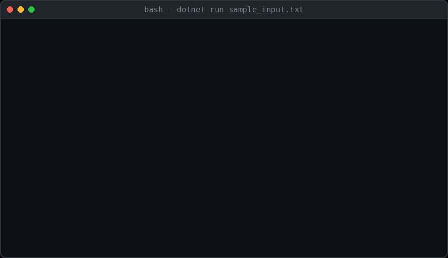
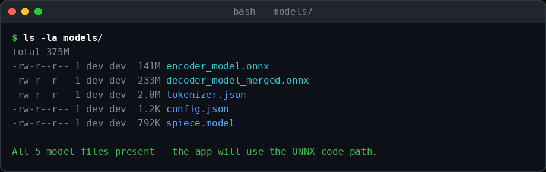
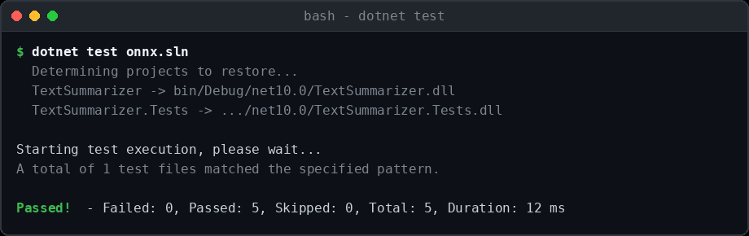

# ONNX Text Summarizer for .NET

[](https://github.com/raulkivi/onnx-text-summarizer-dotnet/actions/workflows/ci.yml)
[](LICENSE)

A modern .NET Core application that demonstrates **how to integrate ONNX models** into a text summarization pipeline. Perfect for developers learning to work with machine learning models in .NET applications.

> **Status:** the extractive (word-frequency) summarizer is fully functional. The ONNX/T5 neural
> generation path loads the encoder/decoder models but does not yet run inference through them —
> see [Current Limitations](#current-limitations) before relying on it for real AI-generated summaries.



*Simulated terminal session illustrating the exact console output the app produces for `dotnet build` → `dotnet run sample_input.txt` → `cat summary.txt`.*

## 🎯 What You'll Learn

- How to integrate ONNX Runtime with .NET Core
- Loading and using pre-trained AI models (T5 for text summarization)
- Tokenization and text preprocessing for neural models
- Fallback strategies when models aren't available
- Real-world AI application architecture

## ✨ Features

- **Extractive Summarization**: Word frequency analysis with position bias and keyword detection (fully implemented)
- **ONNX Model Loading**: Loads a pre-trained T5 encoder/decoder for future neural summarization (inference not yet implemented — see [Current Limitations](#current-limitations))
- **Automatic Model Detection**: Switches between the two code paths based on model file availability
- Outputs summary to `summary.txt`

## 📋 Requirements

- **.NET 10.0** or later ([Download here](https://dotnet.microsoft.com/download))
- **Python 3.7+** (for the model finder utility)
- **4GB+ RAM** (recommended for ONNX models)
- **1GB+ free disk space** (for model downloads)

## 🚀 Quick Start (5 Minutes)

### Step 1: Clone and Setup
```bash
# Clone the repository
git clone <repository-url>
cd onnx

# Restore NuGet packages
dotnet restore
```

### Step 2: Download ONNX Models (First Time Only)
The application needs AI models to work. You have two options:

**Option A: Automatic Download (Recommended)**
```bash
# The models will be downloaded automatically on first run
dotnet build
dotnet run sample_input.txt
```

**Option B: Manual Model Setup**

#### Step-by-Step Download Instructions

1. **Create the models directory**
   ```bash
   mkdir models
   cd models
   ```

2. **Download model files from Hugging Face**
   
   Visit [Falconsai/text_summarization](https://huggingface.co/Falconsai/text_summarization) and download these files:

   | File Name | Size | Download Link | Description |
   |-----------|------|---------------|-------------|
   | `encoder_model.onnx` | ~141MB | [Download](https://huggingface.co/Falconsai/text_summarization/resolve/main/onnx/encoder_model.onnx) | Text encoder model |
   | `decoder_model_merged.onnx` | ~233MB | [Download](https://huggingface.co/Falconsai/text_summarization/resolve/main/onnx/decoder_model_merged.onnx) | Text decoder model |
   | `tokenizer.json` | ~2MB | [Download](https://huggingface.co/Falconsai/text_summarization/resolve/main/onnx/tokenizer.json) | Tokenizer configuration |
   | `config.json` | ~1KB | [Download](https://huggingface.co/Falconsai/text_summarization/resolve/main/onnx/config.json) | Model configuration |
   | `spiece.model` | ~792KB | [Download](https://huggingface.co/Falconsai/text_summarization/resolve/main/onnx/spiece.model) | SentencePiece model |

3. **Alternative: Download using wget/curl** (if available)
   ```bash
   # Windows (using curl)
   curl -L -o encoder_model.onnx "https://huggingface.co/Falconsai/text_summarization/resolve/main/onnx/encoder_model.onnx"
   curl -L -o decoder_model_merged.onnx "https://huggingface.co/Falconsai/text_summarization/resolve/main/onnx/decoder_model_merged.onnx"
   curl -L -o tokenizer.json "https://huggingface.co/Falconsai/text_summarization/resolve/main/onnx/tokenizer.json"
   curl -L -o config.json "https://huggingface.co/Falconsai/text_summarization/resolve/main/onnx/config.json"
   curl -L -o spiece.model "https://huggingface.co/Falconsai/text_summarization/resolve/main/onnx/spiece.model"
   ```

4. **Verify your folder structure**
   ```
   onnx/
   ├── models/
   │   ├── encoder_model.onnx
   │   ├── decoder_model_merged.onnx
   │   ├── tokenizer.json
   │   ├── config.json
   │   └── spiece.model
   ├── Program.cs
   ├── TextSummarizer.cs
   └── ...
   ```

   

5. **Navigate back to project root**
   ```bash
   cd ..
   ```

> **📝 Important**: Model files are excluded from git (see `.gitignore`) because they are large (375MB+ total). Each developer needs to download them locally. This keeps the repository lightweight while ensuring everyone gets the latest model versions.

### Step 3: Run Your First Summarization
```bash
# Test with the included sample
dotnet run sample_input.txt

# View the AI-generated summary
type summary.txt
```

### Step 4: Try Your Own Text
```bash
# Create your own input file
echo "Your long text here..." > my_text.txt

# Summarize it
dotnet run my_text.txt
```

## 🔧 Troubleshooting Model Downloads

### Common Issues and Solutions

**❌ Problem: "Model files not found" error**
```
Solution: Verify all 5 model files are in the models/ folder:
- encoder_model.onnx (141MB)
- decoder_model_merged.onnx (233MB) 
- tokenizer.json (2MB)
- config.json (1KB)
- spiece.model (792KB)
```

**❌ Problem: Download interruption or corrupted files**
```bash
# Check file sizes to verify complete downloads
dir models\
# Windows

ls -la models/
# Linux/Mac

# Re-download any files that seem too small
```

**❌ Problem: Slow downloads from Hugging Face**
```
Try these alternatives:
1. Use a download manager for large files
2. Download during off-peak hours
3. Use git-lfs if you have it installed:
   git lfs install
   git clone https://huggingface.co/Falconsai/text_summarization models-temp
   copy models-temp/*.* models/
```

**❌ Problem: Output is always the extractive summary, even with model files present**
```
This is expected today: neural generation isn't implemented yet, so the app always produces
an extractive summary (see Current Limitations below). If you're instead seeing
"ONNX models not found, using extractive summarization..." when you expect the models to be
picked up, check:
1. All model files exist in models/ folder
2. File sizes match expected values
3. No file corruption (try re-downloading)
4. Sufficient RAM (4GB+ recommended)
```

## 🧠 Understanding the ONNX Models

### What is ONNX?
**ONNX (Open Neural Network Exchange)** is a standard format for AI models that allows you to use models trained in different frameworks (PyTorch, TensorFlow, etc.) in .NET applications.

### Models in This Project
This project uses the **T5 (Text-To-Text Transfer Transformer)** model fine-tuned for summarization:

| File | Purpose | Size | Description |
|------|---------|------|-------------|
| `encoder_model.onnx` | Text Understanding | ~141MB | Processes and understands input text |
| `decoder_model_merged.onnx` | Summary Generation | ~233MB | Generates the actual summary |
| `tokenizer.json` | Text Processing | ~2MB | Converts text to numbers the AI understands |
| `config.json` | Model Settings | ~1KB | Configuration for the model |
| `spiece.model` | Tokenization | ~792KB | SentencePiece tokenizer model |

### How It Works
This is the target pipeline the code is structured around — see [Current Limitations](#current-limitations)
for what's actually implemented today.
1. **Input Text** → Tokenizer converts text to numbers
2. **Encoder** → Understands the meaning and context
3. **Decoder** → Generates a concise summary
4. **Output** → Summary is converted back to readable text

<a id="current-limitations"></a>
## &#9888;&#65039; Current Limitations

- **Neural generation isn't implemented yet.** `ONNXTextSummarizer` loads the T5 encoder and
  decoder sessions and validates that the model files are readable, but `SummarizeText()` does not
  run a forward pass through them. It currently returns the extractive summary, clearly labeled
  `[Extractive fallback — ONNX neural generation not yet implemented]`, so output is never
  misattributed to the neural model. Implementing real generation requires:
  - Proper SentencePiece tokenization of the input (the `spiece.model` file is present but unused)
  - An encoder forward pass to get contextual embeddings
  - Autoregressive decoding through `decoder_model_merged.onnx`, including its `use_cache_branch`
    input and past-key-value handling
- **Tokenizer vocabulary loading is broken for this model's `tokenizer.json`.** T5's SentencePiece
  unigram vocab is stored as an array of `[token, score]` pairs, but `LoadTokenizer()` assumes an
  object map and throws during parsing; it's caught and silently replaced with a 3-token
  placeholder vocabulary. You'll see a `Warning: Could not load tokenizer vocabulary` line on every
  run with models present.
- **No automated coverage of the ONNX path.** The `tests/` project covers the extractive
  summarizer; there is no test exercising `ONNXTextSummarizer` (partly because the 375MB+ model
  files aren't checked into the repo, so CI can't load them).

Contributions implementing real ONNX inference are very welcome — see
[Contributing & Learning](#-contributing--learning).

## 🧪 Running Tests

The extractive summarizer is covered by an xUnit test project under `tests/TextSummarizer.Tests`,
which also runs in CI on every push and pull request to `main`.

```bash
dotnet test onnx.sln
```



## 💡 Code Architecture

### Key Classes
- **`ONNXTextSummarizer`**: Main ONNX model integration class
- **`TextSummarizer`**: Fallback extractive summarizer
- **`Program`**: Application entry point with model detection

### ONNX Integration Code Example
```csharp
// Initialize ONNX model
using var onnxSummarizer = new ONNXTextSummarizer("models/");

// Summarize text using AI
string summary = onnxSummarizer.SummarizeText(inputText);
```

### Required NuGet Packages
```xml
<PackageReference Include="Microsoft.ML.OnnxRuntime" Version="1.29.0" />
<PackageReference Include="Microsoft.ML.Tokenizers" Version="2.0.0" />
```

## 🔍 Finding More ONNX Models

The project includes a Python utility to help you discover other ONNX models for text summarization.

### Prerequisites
```bash
pip install requests
```

### Usage
```bash
python onnx_model_finder.py
```

### What You'll See
```
🔍 Top ONNX Text Summarization Models:
============================================================
 1. Falconsai/text_summarization
    Downloads: 1,234
    Likes: 56
    URL: https://huggingface.co/Falconsai/text_summarization
```

This tool helps you:
- **Discover** other ONNX summarization models
- **Compare** model sizes and popularity  
- **Get direct URLs** for downloading models
- **Understand file structures** of different models

## 🛠️ Installation & Setup

### Detailed Installation Steps

1. **Prerequisites**
   ```bash
   # Verify .NET is installed
   dotnet --version
   # Should show 10.0.x or later
   ```

2. **Clone and Navigate**
   ```bash
   git clone <your-repo-url>
   cd onnx
   ```

3. **Restore Dependencies**
   ```bash
   dotnet restore
   ```

4. **Build the Project**
   ```bash
   dotnet build
   ```

5. **First Run (Downloads Models)**
   ```bash
   # This will automatically download ONNX models on first run
   dotnet run sample_input.txt
   ```

## 📖 Usage Examples

### Basic Usage
```bash
dotnet run <input-file.txt>
```

### Real-World Example

```bash
# Create a sample article about AI
echo "Artificial intelligence is transforming industries worldwide. Machine learning algorithms are becoming more sophisticated every day. Companies are investing billions in AI research and development. Natural language processing enables computers to understand human language better than ever before. Deep learning models can now generate human-like text, translate languages, and summarize complex documents. The future of AI looks incredibly promising with applications in healthcare, finance, education, and transportation. However, ethical considerations around AI development remain crucial for responsible innovation." > article.txt

# Summarize with ONNX AI model
dotnet run article.txt

# View the AI-generated summary
type summary.txt
```

**Expected Output (with model files present):**
```
Processing file: article.txt
ONNX model files found; loading (neural generation is not yet implemented — see README)...
ONNX models loaded successfully!
Summary generated successfully!
Summary saved to: summary.txt
```

`summary.txt` will contain an extractive summary prefixed with
`[Extractive fallback — ONNX neural generation not yet implemented]`, since the encoder/decoder
models are loaded but not yet run for generation (see [Current Limitations](#current-limitations)).
Without the model files present, the prefix and the "ONNX model files found" line are skipped entirely.

## 🔧 How It Works (Technical Details)

### ONNX Model Pipeline
1. **Model Loading**: Load encoder/decoder ONNX models using `InferenceSession`
2. **Text Tokenization**: Convert input text to token IDs using T5 tokenizer
3. **Encoding**: Process tokens through the encoder to get context representations
4. **Decoding**: Generate summary tokens using the decoder model
5. **Detokenization**: Convert output tokens back to readable text

### Fallback Strategy
If ONNX models aren't available, the application falls back to extractive summarization:
1. **Text Preprocessing**: Split text into sentences
2. **Word Frequency Analysis**: Calculate frequency of important words
3. **Sentence Scoring**: Score based on word frequency, position, and keywords
4. **Summary Generation**: Select top-scored sentences

### Code Flow
```
Program.cs → Detects available models → ONNXTextSummarizer or TextSummarizer → Output
```

## ⚙️ Configuration & Customization

### Model Parameters
You can customize the summarization behavior by modifying these parameters in the code:

**ONNX Model Settings:**
- `maxTokens`: Maximum input length (default: 512)
- `maxSummaryLength`: Maximum summary length (default: 150)
- `temperature`: Generation randomness (default: 0.7)

**Extractive Fallback Settings:**
- `maxSentences`: Number of sentences in summary (default: 3)
- Stop words list for filtering
- Keyword importance weights

### Adding New Models
To use a different ONNX model:

1. **Download Model Files**
   ```bash
   # Use the model finder to discover alternatives
   python onnx_model_finder.py
   ```

2. **Update Model Path**
   ```csharp
   // In ONNXTextSummarizer.cs
   string modelPath = "path/to/your/model";
   ```

3. **Adjust Tokenizer** (if needed)
   - Update tokenizer configuration for different model architectures
   - Modify special tokens (PAD, EOS, UNK) if required

## 🚀 Advanced Usage

### Integrating Into Your Own Project

1. **Add NuGet Packages**
   ```xml
   <PackageReference Include="Microsoft.ML.OnnxRuntime" Version="1.29.0" />
   <PackageReference Include="Microsoft.ML.Tokenizers" Version="2.0.0" />
   ```

2. **Copy Core Classes**
   - `ONNXTextSummarizer.cs` - Main ONNX integration
   - `TextSummarizer.cs` - Fallback implementation

3. **Initialize in Your Code**
   ```csharp
   try
   {
       // Try ONNX first
       using var onnxSummarizer = new ONNXTextSummarizer("models/");
       string summary = onnxSummarizer.SummarizeText(inputText);
   }
   catch
   {
       // Fallback to extractive
       var extractiveSummarizer = new TextSummarizer();
       string summary = extractiveSummarizer.SummarizeText(inputText);
   }
   ```

### Performance Tips
- **Memory**: ONNX models require ~2GB RAM during inference
- **Speed**: First run is slower due to model loading
- **Batch Processing**: Process multiple texts without reloading models

## 🔮 What's Next?

### Learning Opportunities
This project is a great starting point for:
- **ONNX Runtime mastery** - Learn to integrate any ONNX model
- **Tokenization understanding** - See how text becomes numbers
- **Model comparison** - Neural vs. traditional approaches
- **Performance optimization** - Batch processing, caching, etc.

### Potential Enhancements
- **Multi-language support** - Use multilingual T5 models
- **Different model types** - BART, GPT, or custom models
- **Batch processing** - Summarize multiple documents
- **Web API** - Create a REST API for summarization
- **Streaming** - Real-time text processing
- **GPU acceleration** - Use ONNX Runtime GPU provider

### Related ONNX Models You Can Try
- **Text Classification**: Sentiment analysis, topic classification
- **Question Answering**: BERT-based Q&A models  
- **Translation**: Machine translation models
- **Text Generation**: GPT-style text generation

## 🤝 Contributing & Learning

This is a learning-focused project! Feel free to:
- Experiment with different models
- Optimize performance  
- Add new features
- Share your improvements

## 📚 Additional Resources

- [ONNX Runtime Documentation](https://onnxruntime.ai/)
- [Microsoft.ML.OnnxRuntime (NuGet package)](https://www.nuget.org/packages/Microsoft.ML.OnnxRuntime/)
- [Hugging Face ONNX Models](https://huggingface.co/models?library=onnx)
- [T5 Paper: "Exploring the Limits of Transfer Learning"](https://arxiv.org/abs/1910.10683)

## License

MIT License
